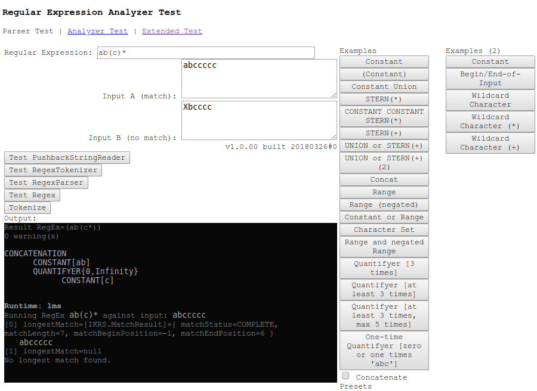

regular_expressions.js
======================

A configurable regular expression parser and customizable analyzer builder beyond 
the default javascript capabilities.

See the js/ikrs/IKRS.Analyzer class or the main_analyzer.html example.

A live [demo is here](http://int2byte.de/public/asylum/regular_expressions/main_analyzer.html)


*Note:* Since version 1.0.0 the file js/regular_expressions.lib.js is deprecated.
Use dist/regular_expression.min.js


## Regular expression grammar
```
REGEX := '(' REGEX ')' |
      	 '^' REGEX |
         CHARACTERSET |
         REGEX '|' REGEX |
         REGEX REGEX |
	 REGEX QUANTIFIER
         ATOM

CHARACTERSET := '['  CSETDEF ']' |
      	     	'[^' CSETDEF ']' |
		'['  CSETFED '&&' CSETDEF ']'   // intersection

CSETDEF := CRANGE |
	    ANYCHARACTER+ CSETDEF

CRANGE := ANYCHARACTER '-' ANYCHARACTER

QUANTIFIER := '*' | 
	      '+' |
	      '{' NUMBER '}' |
	      '{' NUMBER ',' NUMBER '}' |
	      '?'

ATOM := ANYCHARACTER |
        '\' ESCAPECHAR |
        ATOM ATOM
        \uXXXX       %% unicode char
        \xXX         %% ASCII char
	^            %% begin of input
	$            %% end of input

ESCAPECHAR := 'n' | 'b' | 'r' | 's' | 'S' | 'w' | 'W' | 'd' | 'D' | <operator_char>
```

## What it looks like

This is what the example and test page looks like.



## Build a simple lexicographical analyzer
Example script (Javascript), define the rule set (what your tokens look like):
```javascript
    var analyzer = new IKRS.Analyzer();
    try {

	analyzer.addRule( "REGISTER",               // Any name for this rule. Duplicates allowed.
			  "EAX|EBX|ECX|EDX|IP",     // The regular expression to be matched.
			  dummy.append,             // The callback function to call on input match.
			  { fontColor: "#00a800" }  // Any custom object. Will be passed as 'callbackParams' to the callback function
			);
	analyzer.addRule( "MNEMONIC", 
			  "MV|CMP|JNE|ADD|CMP|JE|JNE|JMP|JGT|CMP|JLT|MUL|MOD|INC|DEC|SUB|RETR|RETURN|PUSH|CALL|POP|MALLOC|MDEALLOC", 
			  function(name,value,matchResult) { 
			      dummy.sb.append("<span style=\"font-weight: bold;\">" + value + "</span>"); 
			  },
			  { fontColor: "#a8a8a8" }
			);
	analyzer.addRule( "NUMBER", 
			  "\\d+",
			  dummy.append,
			  { fontColor: "#8800a8" }
			);
	analyzer.addRule( "TERMINATOR",
			  ".",
			  function(name,value,matchResult) { 
			      dummy.sb.append(value); 
			  }, 
			  { fontColor: "#880088" }
			);
   }
```

And this is the way to use your analzer:

```javascript
	var GET_FIRST_MATCH = true;  // alternative: get longest match (not wha we want here)
	var startTime       = new Date().getTime();
	while( !reader.reachedEOI() && reader.available() > 0 ) {

	    var matchResult = analyzer.nextMatch( reader, GET_FIRST_MATCH );
	    	    
	    if( matchResult == null ) {
		// First case: no rule could be matched.
		// Consume current token
		var c = reader.read();
		console.log( "_anonymous_:" + c + "<br/>\n" );

	    } else if( matchResult.matchLength == 0 ) {
		// Second case: found match has zero length
		// Consume one token
		var c = reader.read();
		console.log( "_anonymous_:" + c + "<br/>\n" );
		
	    } else {
		// Last case: found match has length > 0
		// Action was already triggered ^^
		
	    }

	}	
```


The example input 'MV EAX,54' will be tokenized into
 * MV
 * <space>
 * EAX
 * ,
 * 54

See a small working example for
 * [Assembler](https://www.int2byte.de/public/asylum/regular_expressions/main_analyzer.html Assembler)
 * [Javascript](https://www.int2byte.de/public/asylum/regular_expressions/main_extended.html Javascript)


### Examples for regular expressions

```
AB		Concatenation Operator, concats A and B (has no symbol, implicit between operands).
A|B 		Union Operator of A and B; correlates to logical OR.
A* 		Quantifying: repetition Operator (Kleene Stern); repeat A n times where n=0 is allowed (empty expression).
A+ 		Quantifying: repetition Operator (non-empty); repeat A n times where n>0 is required (non-empty expression).
A{n} 		Quantifying: repetition Operator (minimum); repeat A at least n times (more allowed).
A{n,} 		Quantifying: repetition Operator (exact); repeat A exactly n times.
A{n,m} 		Quantifying: repetition Operator (minimum and maximum); repeat A at least n times but not more than m times.
A?		Quantifying: repitition Operator (zero or one occurences); find 0 or 1 times; equivalent to {0,1}.
(A) 		Parenthesis: bind composite expressions together against stronger operators.
		Operator precedence: Union < Concatenation < Quantifying Operators < Parenthesis
```

### Regular Grammars: Notation
```
a 		The single character a
asdf 	    	The constant character sequence asdf
asdf|qwertz 	The constant character sequence asdf OR qwertz
asdf* 		The sequence asdf zero or n times.
asdf+ 		The sequence asdf at least one or n times.
(abcd|xyz)* 	Any sequence (including empty) that cosists of abcd and xyz sub sequences only
cat{3} 		The sequence cat three times: catcatcat
cat{3,5} 	The sequence cat three to five times: catcatcat, catcatcatcat or catcatcatcatcat
cat{3,} 	The sequence cat at least three times: catcatcat, catcatcatcat or catcatcatcatcat, catcatcatcatcatcat, ...
```

Escaping Characters
```
\\		The backslash character
\. 		Punctuation mark (to distinct from wildcard token)
\^ 		Circumflex (to distinct from begin-of-input token)
\$ 		Dollar (to distinct from end-of-input token)
\0n 		The character with octal value 0n (0 <= n <= 7)
\0nn 		The character with octal value 0nn (0 <= n <= 7)
\0mnn 		The character with octal value 0mnn (0 <= m <= 3, 0 <= n <= 7)
\xhh 		The character with hexadecimal value 0xhh
\uhhhh 		The character with hexadecimal value 0xhhhh
\t 		The tab character ('\u0009')
\n 		The newline (line feed) character \u000A
\r 		The carriage-return character \u000D
\f 		The form-feed character ('\u000C')
\a 		The alert (bell) character ('\u0007')
\e 		The escape character ('\u001B')
\<operator> 	Any operator symbol escaped (use as non-operator token)
```

Special tokens
```
^		Start of input.
$ 		End of input.
. 		Any character (wild card).
Character 	Sets and Ranges
[abc] 		a, b, or c (simple class)
[^abc] 		Any character except a, b, or c (negation)
[a-z] 		a through z, inclusive (range)
[a-zA-Z] 	a through z or A through Z, inclusive (range)
[^a-zA-Z] 	Any character except a through z and A through Z (range and negation)
[a-z&&[def]] 	d, e, or f (intersection)
[a-z&&[^bc]] 	a through z, except for b and c: [ad-z] (subtraction)
[a-z&&[^m-p]] 	a through z, and not m through p: [a-lq-z](subtraction)
```

Predefined Character Classes
```
\d 	   	A digit: [0-9]
\D 		A non-digit: [^0-9]
\s 		A whitespace character: [\t\n\x0B\f\r]
\S 		A non-whitespace character: [^\s]
\w 		A word character: [a-zA-Z_0-9]
\W 		A non-word character: [^\w]
```


	


